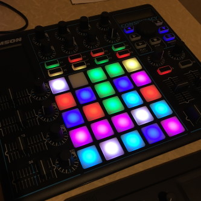

# Samson Conspiracy как Control Surface в Ableton Live

## Что сделано
1. Транспорт (PLAY, STOP)
    - RECORD планируется использовать как Shift
2. Микшер
    - XFader (crossfader) управляет Master Volume
    - Слайдеры S1 - S4 управляют балансом треков 1 - 4
    - Энкодеры P1 - P4 управляют громкостью треков 1 - 4
    - Слайдеры S5, S6 управляют громкостью return-треков
3. Сессия 
    - Стрелки управляют перемещением сессии по трекам (left, right) и сценам (up, down)
    - Пэды, правый столбец (05, 10, 15, 20, 25) - Launch Scene
    - Пэды, 5 строк * 4 столбца, управляют запуском клипов 
    
## Установка скрипта в Ableton Live
### Windows
Скопировать каталог `Conspiracy` в каталог `%AbletonLive_InstallPath%\Resources\MIDI Remote Scripts`. 

## Настройка MIDI-параметров в контроллере
### Transport
| Кнопка | Канал | Note/CC | Значение | Нота  | Тип       |
| ------ | -----:| ------- | --------:| ----- | --------- |
| PLAY   |     1 | Note    |       38 | D  1  | Momentary |
| CANCEL |     1 | Note    |       39 | D# 1  | Momentary |
| RECORD |     1 | Note    |       40 | E  1  | Momentary |

У этих кнопок два цвета: 
- 0, чёрный (выключенный)
- 1, синий

### Стрелки
| Кнопка | Канал | Note/CC | Значение | Нота  | Тип       |
| ------ | -----:| ------- | --------:| ----- | --------- |
| LEFT   |     1 | Note    |       34 | A# 0  | Momentary |
| RIGHT  |     1 | Note    |       36 | C  1  | Momentary |
| UP     |     1 | Note    |       35 | B  0  | Momentary |
| DOWN   |     1 | Note    |       37 | C# 1  | Momentary |

У этих кнопок два цвета: 
- 0, чёрный (выключенный)
- 1, синий

### Pads
#### Правый (пятый) столбец, пять пэдов
| Pad    | Канал | Note/CC | Значение | Нота  | Тип       |
| ------ | -----:| ------- | --------:| ----- | --------- |
| 05     |     1 | Note    |        4 | E  -2 | Momentary |
| 10     |     1 | Note    |        9 | A  -2 | Momentary |
| 15     |     1 | Note    |       14 | D  -1 | Momentary |
| 20     |     1 | Note    |       19 | G  -1 | Momentary |
| 25     |     1 | Note    |       24 | C   0 | Momentary |

#### Пэды запуска клипов
| Pad    | Канал | Note/CC | Значение | Нота  | Тип       |
| ------ | -----:| ------- | --------:| ----- | --------- |
| 01     |     1 | Note    |        0 | C  -2 | Momentary |
| 02     |     1 | Note    |        1 | C# -2 | Momentary |
| 03     |     1 | Note    |        2 | D  -2 | Momentary |
| 04     |     1 | Note    |        3 | D# -2 | Momentary |
| -      |     - | -       |        - | -     | -         |
| 06     |     1 | Note    |        5 | F  -2 | Momentary |
| 07     |     1 | Note    |        6 | F# -2 | Momentary |
| 08     |     1 | Note    |        7 | G  -2 | Momentary |
| 09     |     1 | Note    |        8 | G# -2 | Momentary |
| -      |     - | -       |        - | -     | -         |
| 11     |     1 | Note    |       10 | A# -2 | Momentary |
| 12     |     1 | Note    |       11 | B  -2 | Momentary |
| 13     |     1 | Note    |       12 | C  -1 | Momentary |
| 14     |     1 | Note    |       13 | C# -1 | Momentary |
| -      |     - | -       |        - | -     | -         |
| 16     |     1 | Note    |       15 | D# -1 | Momentary |
| 17     |     1 | Note    |       16 | E  -1 | Momentary |
| 18     |     1 | Note    |       17 | F  -1 | Momentary |
| 19     |     1 | Note    |       18 | F# -1 | Momentary |
| -      |     - | -       |        - | -     | -         |
| 21     |     1 | Note    |       20 | G# -1 | Momentary |
| 22     |     1 | Note    |       21 | A  -1 | Momentary |
| 23     |     1 | Note    |       22 | A# -1 | Momentary |
| 24     |     1 | Note    |       23 | B  -1 | Momentary |

У падов 8 цветов:
- 0, чёрный (выключенный)
- 1, красный
- 2, зелёный
- 3, синий
- 8, жёлтый
- 25, фиолетовый
- 26, голубой
- 27, белый

### F-кнопки
| Кнопка | Канал | Note/CC | Значение | Нота  | Тип       |
| ------ | -----:| ------- | --------:| ----- | --------- |
| F1     |     1 | Note    |       25 | C# 0  | Momentary |
| F2     |     1 | Note    |       26 | D  0  | Momentary |
| F3     |     1 | Note    |       27 | D# 0  | Momentary |
| F4     |     1 | Note    |       28 | E  0  | Momentary |
| F5     |     1 | Note    |       29 | F  0  | Momentary |
| F6     |     1 | Note    |       30 | F# 0  | Momentary |
| F7     |     1 | Note    |       31 | G  0  | Momentary |
| F8     |     1 | Note    |       32 | G# 0  | Momentary |
| F9     |     1 | Note    |       33 | A  0  | Momentary |
| F10    |     1 | Note    |       41 | F  1  | Momentary |

У этих кнопок четыре цвета: 
- 0, чёрный (выключенный)
- 1, красный
- 2, зелёный
- 8, жёлтый

### Микшер
#### Кроссфэйдер
| Канал | Note/CC | Значение | Нота  |
| -----:| ------- | --------:| ----- |
|     1 | CC      |       15 | -     |

#### Returns
| Элемент    | Канал | Note/CC | Значение | Нота  |
| ---------- | -----:| ------- | --------:| ----- |
| Слайдер S5 |     1 | CC      |       24 | -     |
| Слайдер S6 |     1 | CC      |       25 | -     |

#### Слайдеры и энкодеры баланса и громкости трека
| Элемент    | Канал | Note/CC | Значение | Нота  |
| ---------- | -----:| ------- | --------:| ----- |
| Слайдер S1 |     1 | CC      |       26 | -     |
| Слайдер S2 |     1 | CC      |       27 | -     |
| Слайдер S3 |     1 | CC      |       28 | -     |
| Слайдер S4 |     1 | CC      |       29 | -     |
| Энкодер P1 |     1 | CC      |       30 | -     |
| Энкодер P2 |     1 | CC      |       31 | -     |
| Энкодер P3 |     1 | CC      |       32 | -     |
| Энкодер P4 |     1 | CC      |       33 | -     |
